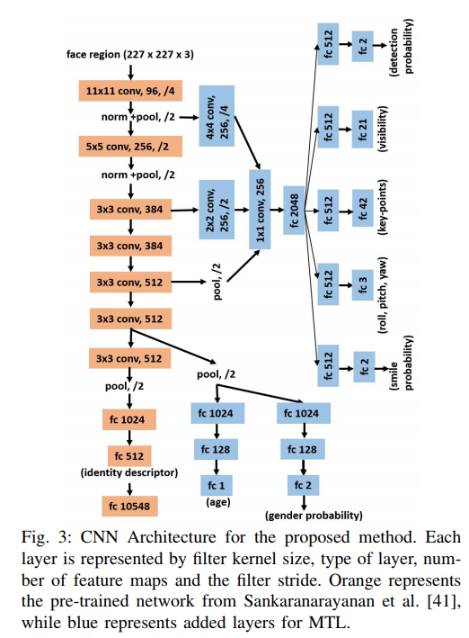

### Title: An All-In-One Convolutional Neural Network for Face Analysis

#### Author: Rajeev Ranjan, Swami Sankaranarayanan, Carlos D. Castillo and Rama Chellappa

#### Published: IEEE International Conference on Automatic Face & Gesture Recognition(FGR or FG) 2017

#### Code: None

## Why

Pervious methods do face related tasks separately, both time and memory inefficiently, and lack of datasets support.

## What

Present a multi-purpose algorithm for simultaneous 
1. **face detection**
2. **face alignment**（landmark localization)
3. **pose estimation**
4. **gender recognition**
5. **smile detection**
6. **age estimation** 
7. **face verification**
8. **face recognition**

Propose a novel CNN architecture, design the MTL(Multi tasks learning) framework, and achieve state-of-the-art performances for most of the tasks.

Differences between this work and hyperface

1. analysis more face related tasks
2. utilize domain-based regularization by training on multiple datasets instead of one dataset
3. initialize the network weights from pretrained network on face recognition instead of alexnet.

## How

parameters from lower layers of cnn are shared among all the tasks

#### Multi-task learning

##### task-based regularization

> $t_i$: task 
>
> $\theta_s$:shared parameters
>
> $\theta_{t_i}$: task-specific parameters
>
> D: input
>
> $J_i(\theta_s,\theta_{t_i};D)$: cost function

for isolated learning, the optimum network parameters $(\theta_s^*, \theta_{t_i}^*)$ can be computed using

$(\theta_s^*, \theta_{t_i}^*)=\arg \min_{(\theta_s,\theta_{t_i})}J_i(\theta_s,\theta_{t_i};D)$

for MTL

$(\theta_s^*, \theta_{t_i}^*)=\arg \min_{(\theta_s,\theta_{t_i})}J_i(\theta_s,\theta_{t_i};D) + \sum_{j\neq i}^n\alpha_jJ_j(\theta_s, \theta_{t_j};D)$

Other tasks can be interpreted as a regularizer $R_i$ on $\theta_s$

$(\theta_s^*, \theta_{t_i}^*)=\arg \min_{(\theta_s,\theta_{t_i})}J_i(\theta_s,\theta_{t_i};D) + \lambda R_i(\theta_s;D)$

#### Domain-based Regularization

Using one shared network to fit different task domains(D1, D2, ...), that is meant to say to use multiple different training sets.

#### Network structure

Using a network pretrained on face recognition.

## Results

see the graphs and tables in the paper.

## Thoughts

1. Lower layers of CNN learn features common to a general set of face analysis tasks whereas upper layers are more specific to individual tasks.

2. divide tasks in two groups(subject-independent & subject-dependent)

3. generating thousand of region proposals and pass them through the network is very time-consuming.

   ​